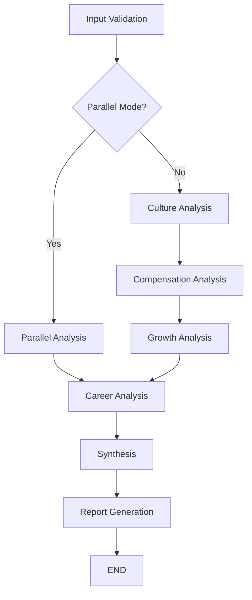

# BlindInsight AI - LangGraph 기반 멀티 에이전트 아키텍처

## 📋 개요

BlindInsight AI는 **LangGraph StateGraph**를 활용한 멀티 에이전트 오케스트레이션 시스템으로, 회사 분석을 위한 RAG(Retrieval Augmented Generation) + MCP(Model Context Protocol) 통합 플랫폼입니다.

## 🏗️ 시스템 아키텍처

### 🔄 워크플로우 구조 (LangGraph StateGraph)



### 🎯 에이전트 계층 구조

#### 1. Base Agent 클래스
```python
BaseAgent (ABC)
├── RAG 검색 기능
├── MCP 서비스 연동
├── LLM 응답 생성
├── 결과 검증 및 성능 추적
└── 오류 처리 및 재시도 로직
```

#### 2. 전문 에이전트들
```
CultureAnalysisAgent (BaseAgent)
├── 회사 문화 분석
├── 워라밸 평가
└── 조직 특성 진단

CompensationAnalysisAgent (BaseAgent)
├── 연봉 정보 분석
├── 복리후생 평가
└── 보상 수준 비교

GrowthStabilityAgent (BaseAgent)
├── 성장성 분석
├── 안정성 평가
└── 미래 전망 예측

CareerPathAgent (BaseAgent)
├── 커리어 경로 분석
├── 개인화된 적합도 평가
└── 발전 가능성 예측
```

## 🔧 핵심 컴포넌트

### 1. **WorkflowState** (LangGraph State)
```yaml
상태 관리:
  - 분석 요청 정보
  - 사용자 프로필
  - 각 에이전트별 결과
  - 진행률 및 오류 추적
  - 성능 메트릭
```

### 2. **워크플로우 노드**
```
InputValidationNode
├── 입력 검증 및 정규화
├── 사용자 프로필 처리
└── 초기 상태 설정

분석 노드들 (병렬/순차 실행)
├── CultureAnalysisNode
├── CompensationAnalysisNode
├── GrowthAnalysisNode
└── ParallelAnalysisNode

후처리 노드들
├── CareerAnalysisNode
├── SynthesisNode
└── ReportGenerationNode
```

### 3. **데이터 소스 통합**

#### RAG (Retrieval Augmented Generation) 시스템
```
Vector Database (ChromaDB)
├── culture_reviews
├── salary_discussions
├── career_advice
├── interview_reviews
└── company_general
```

#### MCP (Model Context Protocol) 통합
```
MCP Providers
├── BlindDataProvider - Blind.com 리뷰 데이터
├── JobSiteProvider - 채용 사이트 정보
├── SalaryDataProvider - 연봉 정보
└── CompanyNewsProvider - 뉴스 및 동향
```

## ⚙️ 실행 모드

### 1. **순차 실행 모드** (Sequential)
```
Input Validation 
  → Culture Analysis 
  → Compensation Analysis 
  → Growth Analysis 
  → Career Analysis 
  → Synthesis 
  → Report Generation
```

**특징:**
- 각 단계별 순차 실행
- 이전 단계 결과를 다음 단계에서 활용
- 안정적이지만 실행 시간이 길어짐

### 2. **병렬 실행 모드** (Parallel)
```
Input Validation 
  → [Culture Analysis || Compensation Analysis || Growth Analysis] 
  → Career Analysis 
  → Synthesis 
  → Report Generation
```

**특징:**
- Core 분석 작업들을 병렬 실행
- 실행 시간 단축 (40-70% 성능 향상)
- asyncio.gather() 활용한 비동기 처리

## 🎭 에이전트별 상세 기능

### Culture Analysis Agent
```
주요 기능:
  - 회사 문화 특성 분석
  - 워라밸 점수 계산
  - 조직 분위기 평가

데이터 소스:
  - RAG: culture_reviews 컬렉션
  - MCP: Blind 리뷰 데이터
  
출력:
  - culture_score (1-100)
  - work_life_balance (1-5)
  - culture_insights
```

### Compensation Analysis Agent
```
주요 기능:
  - 연봉 수준 분석
  - 복리후생 평가
  - 업계 비교 분석

데이터 소스:
  - RAG: salary_discussions 컬렉션
  - MCP: 연봉 정보 제공자
  
출력:
  - salary_range
  - salary_percentile
  - benefits_analysis
```

### Growth & Stability Agent
```
주요 기능:
  - 회사 성장성 분석
  - 재무 안정성 평가
  - 미래 전망 예측

데이터 소스:
  - MCP: 뉴스 데이터
  - RAG: 회사 전반 정보
  
출력:
  - growth_score (1-100)
  - stability_score (1-100)
  - future_outlook
```

### Career Path Agent
```
주요 기능:
  - 개인화된 커리어 경로 분석
  - 사용자 프로필 기반 적합도
  - 성장 가능성 예측

데이터 소스:
  - RAG: career_advice 컬렉션
  - 다른 에이전트 결과 (context)
  
출력:
  - success_probability
  - timeline_estimate
  - recommended_actions
```

## 🔄 데이터 흐름

### 1. 사용자 요청 → 워크플로우 초기화
```
User Request
  ↓
AnalysisRequest 생성
  ↓
WorkflowState 초기화
  ↓
LangGraph StateGraph 실행
```

### 2. RAG + MCP 데이터 통합
```
Agent 실행
  ↓
RAG 검색 (Vector DB)
  ↓
MCP 서비스 호출
  ↓
LLM 분석 (OpenAI GPT-4)
  ↓
결과 검증 및 저장
```

### 3. 결과 합성 및 보고서 생성
```
각 에이전트 결과
  ↓
SynthesisNode (결과 통합)
  ↓
ReportGenerationNode
  ↓
최종 분석 보고서
```

## 📊 성능 및 확장성

### 성능 최적화
```
캐싱 전략:
  - RAG 검색 결과 캐싱 (TTL: 1시간)
  - MCP 서비스 응답 캐싱
  - LLM 응답 캐싱 (동일 쿼리)

병렬 처리:
  - 에이전트별 비동기 실행
  - MCP 서비스 병렬 호출
  - Vector DB 배치 검색
```

### 확장성 설계
```
모듈화 구조:
  - 새로운 에이전트 쉽게 추가 가능
  - MCP Provider 확장 가능
  - RAG 컬렉션 동적 추가

설정 기반 제어:
  - WorkflowConfig로 동작 제어
  - AgentConfig로 개별 설정
  - 런타임 설정 변경 가능
```

## 🛠️ 개발 및 배포

### 로컬 개발 환경
```bash
# 가상환경 활성화
./blindinsight-env/Scripts/activate

# 애플리케이션 실행
streamlit run main.py
```

### 주요 디렉토리 구조
```
src/blindinsight/
├── agents/          # 전문 에이전트들
├── workflow/        # LangGraph 워크플로우
├── rag/            # RAG 시스템
├── mcp/            # MCP 통합
├── models/         # 데이터 모델
├── frontend/       # Streamlit UI
└── services/       # 공통 서비스
```

## 🔮 향후 발전 방향

### 1. 에이전트 확장
- **InterviewAgent**: 면접 후기 전문 분석
- **CompetitorAgent**: 경쟁사 비교 분석
- **TrendAgent**: 업계 트렌드 분석

### 2. 고급 기능
- **멀티 에이전트 토론**: Agent끼리 결과 검증
- **개인화 강화**: 사용자 행동 기반 추천
- **실시간 업데이트**: 스트리밍 분석 결과

### 3. 성능 향상
- **GPU 가속**: Vector 검색 최적화
- **분산 처리**: 다중 서버 배포
- **지능형 캐싱**: ML 기반 캐시 전략

---

## 🎯 핵심 특징 요약

1. **LangGraph StateGraph**: 워크플로우 상태 관리 및 오케스트레이션
2. **멀티 에이전트 협업**: 전문화된 에이전트들의 협업적 분석
3. **RAG + MCP 통합**: 내부 지식베이스와 외부 API 연동
4. **병렬/순차 실행**: 성능과 안정성 사이의 선택 가능
5. **모듈화 설계**: 새로운 에이전트와 데이터 소스 쉽게 추가
6. **포괄적 분석**: 문화, 연봉, 성장성, 커리어 등 종합 분석
7. **개인화**: 사용자 프로필 기반 맞춤형 분석
8. **실시간 UI**: Streamlit 기반 인터랙티브 웹 인터페이스

이 아키텍처는 확장 가능하고 유지보수가 용이하며, 각 컴포넌트가 독립적으로 발전할 수 있도록 설계되었습니다.