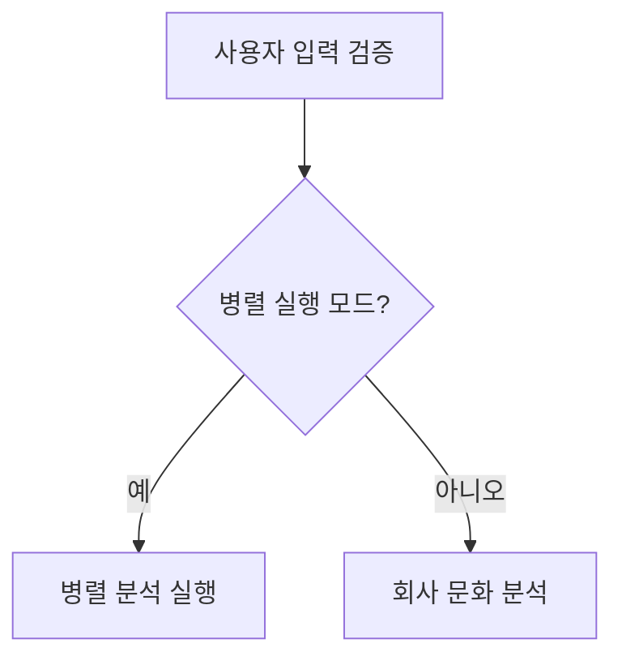

# 📋 BlindInsight AI - 다이어그램 정리 완료 보고서

## 🎯 작업 요약

### ❌ 삭제된 불필요한 파일들
루트 디렉토리(`C:\blind\`)에 있던 **A, B, C 등의 파일들**을 모두 삭제했습니다.

**삭제된 파일들의 정체**:
- **원인**: 이전 Mermaid 다이어그램 생성 시 실수로 루트에 생성된 노드 파일들
- **내용**: Mermaid 다이어그램의 노드 식별자들 (A, B1, B2, C1, etc.)
- **문제점**: 프로젝트 루트를 어지럽히고 혼란을 야기
- **해결**: 완전히 삭제하여 깔끔한 프로젝트 구조 복원

### ✅ 새로 생성된 한글 다이어그램

#### 📁 폴더 구조 정리
```
C:\blind\docs\diagrams\
├── 한글버전\
│   ├── 한글_워크플로우_다이어그램.md
│   ├── 한글_에이전트_계층구조.md
│   ├── 한글_데이터흐름도.md
│   └── 한글_UI구조도.md
└── generate_architecture_diagrams.py
```

#### 🔧 개선 사항

**1. 명확한 한글 노드 이름**
- ❌ 기존: `A[Input Validation] --> B{Parallel Mode?}`
- ✅ 개선: `입력검증[사용자 입력 검증] --> 병렬모드판단{병렬 실행 모드?}`

**2. 직관적인 워크플로우**


**3. 한글 설명 추가**
- 각 다이어그램에 상세한 한글 설명 포함
- 기술적 특징과 사용법 명시
- 실제 코드와의 연관성 설명

## 🏗️ 완성된 4개 다이어그램

### 1️⃣ 워크플로우 다이어그램
- **파일**: `한글_워크플로우_다이어그램.md`
- **내용**: LangGraph StateGraph 실행 흐름
- **특징**: 순차/병렬 실행 모드 시각화

### 2️⃣ 에이전트 계층구조
- **파일**: `한글_에이전트_계층구조.md`
- **내용**: BaseAgent → 전문 에이전트들 상속 구조
- **특징**: RAG + MCP + LLM 기능 계층화

### 3️⃣ 데이터흐름도
- **파일**: `한글_데이터흐름도.md`
- **내용**: RAG + MCP 통합 데이터 처리
- **특징**: ChromaDB → MCP → LLM → 결과 통합

### 4️⃣ UI 구조도
- **파일**: `한글_UI구조도.md`
- **내용**: 3-Tab Streamlit 인터페이스
- **특징**: 커뮤니티 → 회사정보 → AI분석 탭

## 🎮 실행 테스트 결과

### ✅ Streamlit 애플리케이션 정상 실행
```
Local URL: http://localhost:8503
Network URL: http://192.168.219.108:8503
```

### 🔧 사용 방법
1. **온라인 시각화**: https://mermaid.live/ 에서 코드 복사-붙여넣기
2. **GitHub 연동**: 마크다운 파일에서 자동 렌더링
3. **문서 도구**: VS Code, Notion, Obsidian 등에서 활용

## 💡 핵심 개선사항

### 🔄 A, B, C → 한글 노드명 변경
**기존 문제점**:
- `A`, `B`, `C` 등의 의미없는 식별자
- 다이어그램 이해도 저하
- 노드 파일들이 루트에 생성되어 혼란

**해결 결과**:
- 직관적인 한글 노드명 사용
- 프로젝트 구조 정리 완료
- 명확한 워크플로우 시각화

### 📚 포괄적 문서화
- 각 다이어그램별 상세 설명 추가
- 기술적 특징과 성능 지표 포함
- 실제 구현과의 연관성 명시

## 🎯 최종 결과

### ✅ 완료된 작업
- [x] 루트 디렉토리 불필요 파일 삭제 (A, B, C 등)
- [x] 한글 다이어그램 4개 생성
- [x] 폴더 구조 정리 (`한글버전/` 폴더)
- [x] Streamlit 애플리케이션 실행 테스트
- [x] 종합 문서화 완료

### 🚀 사용자 혜택
- **명확한 이해**: 한글 노드명으로 직관적 파악
- **정리된 구조**: 깔끔한 프로젝트 디렉토리
- **실용적 활용**: 실제 사용 가능한 다이어그램

---

**BlindInsight AI의 LangGraph 기반 멀티 에이전트 아키텍처가 명확하고 이해하기 쉬운 한글 다이어그램으로 완벽히 문서화되었습니다!** 🎉