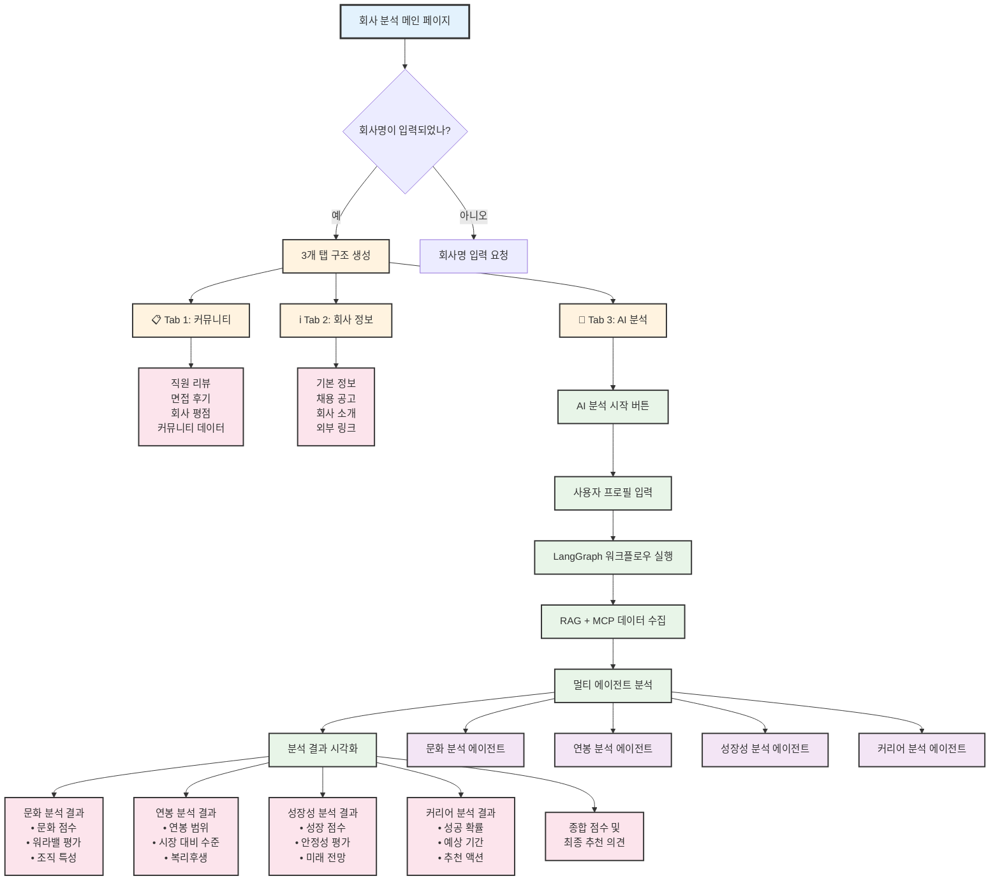

# BlindInsight AI - 사용자 인터페이스 구조 (한글 버전)

## 3-Tab Streamlit 인터페이스

## 탭별 상세 기능

### 📋 Tab 1: 커뮤니티
- **목적**: 실제 직원들의 생생한 경험 공유
- **내용**: 
  - 직원 리뷰 및 평점
  - 면접 후기 및 팁
  - 회사 문화 관련 커뮤니티 글
  - 실시간 업데이트 정보

### ℹ️ Tab 2: 회사 정보  
- **목적**: 객관적인 회사 정보 제공
- **내용**:
  - 회사 기본 정보 (규모, 업종, 위치)
  - 현재 채용 중인 포지션
  - 공식 회사 소개 및 비전
  - 관련 외부 링크 (홈페이지, 뉴스 등)

### 🤖 Tab 3: AI 분석 (핵심 기능)
- **목적**: LangGraph 기반 종합 AI 분석
- **프로세스**:
  1. **사용자 프로필 입력**: 경력, 관심사, 우선순위
  2. **워크플로우 실행**: LangGraph StateGraph 가동
  3. **데이터 수집**: RAG + MCP 통합 검색
  4. **멀티 에이전트 분석**: 4개 전문 에이전트 동시 작업
  5. **결과 시각화**: 차트, 점수, 추천사항 표시

## 핵심 특징

### 🎯 사용자 경험 최적화
- **직관적 탭 구조**: 정보 → 커뮤니티 → AI 분석 순서
- **점진적 정보 제공**: 기본 정보부터 고급 분석까지
- **개인화된 분석**: 사용자 프로필 기반 맞춤 결과

### ⚡ 실시간 상호작용
- **버튼 클릭으로 즉시 분석 시작**
- **진행률 표시 및 단계별 안내**
- **결과를 다양한 형태로 시각화**

### 🔗 통합 아키텍처
- **Streamlit 프론트엔드**와 **LangGraph 백엔드**의 완벽한 연동
- **RAG + MCP** 데이터 소스의 seamless 통합
- **멀티 에이전트 결과**의 unified 인터페이스