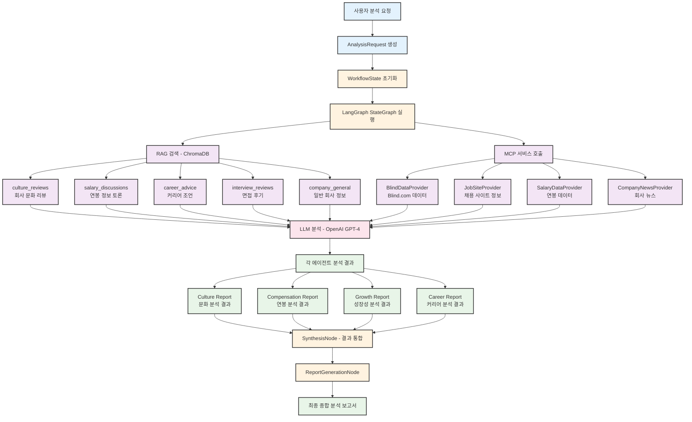

# BlindInsight AI - 데이터 흐름도 (한글 버전)

## RAG + MCP 통합 데이터 처리 흐름

## 데이터 소스별 특징

### 📊 RAG 시스템 (ChromaDB)
- **Vector Database**: 의미론적 유사도 검색
- **컬렉션 분류**: 문화, 연봉, 커리어, 면접, 일반 정보로 체계화
- **검색 방식**: 사용자 질의와 유사한 문서 자동 검색

### 🔗 MCP 서비스 (Model Context Protocol)
- **실시간 데이터**: 외부 API를 통한 최신 정보 수집
- **다양한 소스**: Blind, 채용사이트, 연봉정보, 뉴스 통합
- **동적 연동**: 필요에 따라 실시간으로 데이터 수집

### 🤖 LLM 분석 (OpenAI GPT-4)
- **통합 분석**: RAG + MCP 데이터를 종합적으로 분석
- **전문화**: 각 에이전트별 특화된 분석 수행
- **품질 보장**: 결과 검증 및 신뢰도 점수 제공