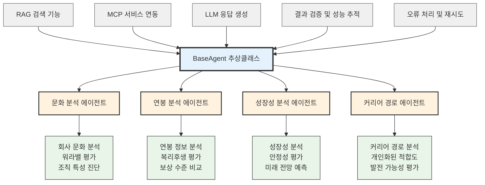

# BlindInsight AI - 에이전트 계층 구조 (한글 버전)

## 멀티 에이전트 시스템 아키텍처

## 에이전트별 전문 분야

### 🏢 문화 분석 에이전트 (CultureAnalysisAgent)
- **주요 기능**: 회사 문화 특성 분석, 워라밸 점수 계산
- **데이터 소스**: culture_reviews 컬렉션, Blind 리뷰 데이터
- **출력**: culture_score (1-100), work_life_balance (1-5)

### 💰 연봉 분석 에이전트 (CompensationAnalysisAgent)  
- **주요 기능**: 연봉 수준 분석, 복리후생 평가
- **데이터 소스**: salary_discussions 컬렉션, 연봉 정보 제공자
- **출력**: salary_range, salary_percentile, benefits_analysis

### 📈 성장성 분석 에이전트 (GrowthStabilityAgent)
- **주요 기능**: 회사 성장성 분석, 재무 안정성 평가  
- **데이터 소스**: 뉴스 데이터, 회사 전반 정보
- **출력**: growth_score (1-100), stability_score (1-100)

### 🎯 커리어 경로 에이전트 (CareerPathAgent)
- **주요 기능**: 개인화된 커리어 경로 분석, 사용자 적합도
- **데이터 소스**: career_advice 컬렉션, 다른 에이전트 결과
- **출력**: success_probability, timeline_estimate, recommended_actions