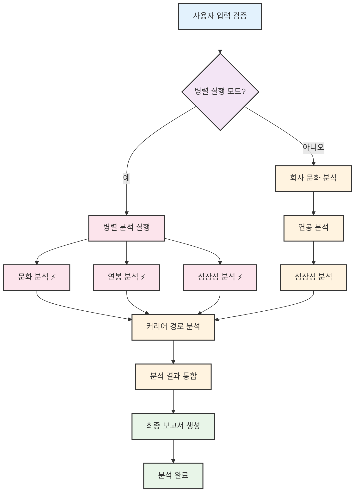

# BlindInsight AI - 워크플로우 다이어그램 (한글 버전)

## LangGraph StateGraph 실행 흐름

## 주요 특징

### 🔄 실행 모드
- **순차 실행**: 문화 → 연봉 → 성장성 → 커리어 순서로 분석
- **병렬 실행**: 문화, 연봉, 성장성을 동시에 분석 후 커리어 분석

### ⚡ 성능 최적화
- 병렬 모드에서 40-70% 성능 향상
- asyncio.gather()를 활용한 비동기 처리

### 🎯 상태 관리
- WorkflowState를 통한 에이전트 간 데이터 공유
- 각 단계별 진행률 추적 및 오류 처리